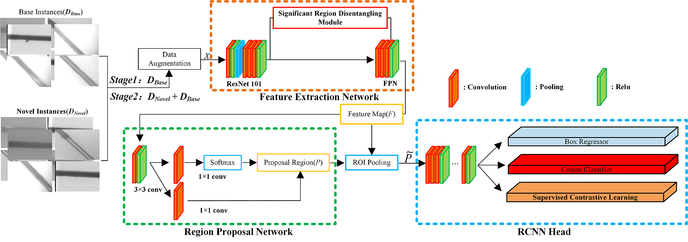
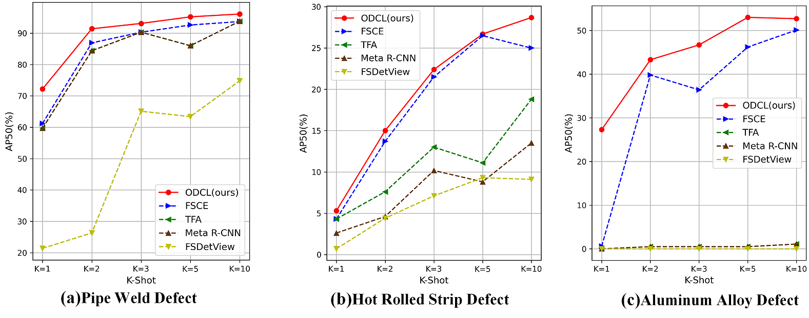
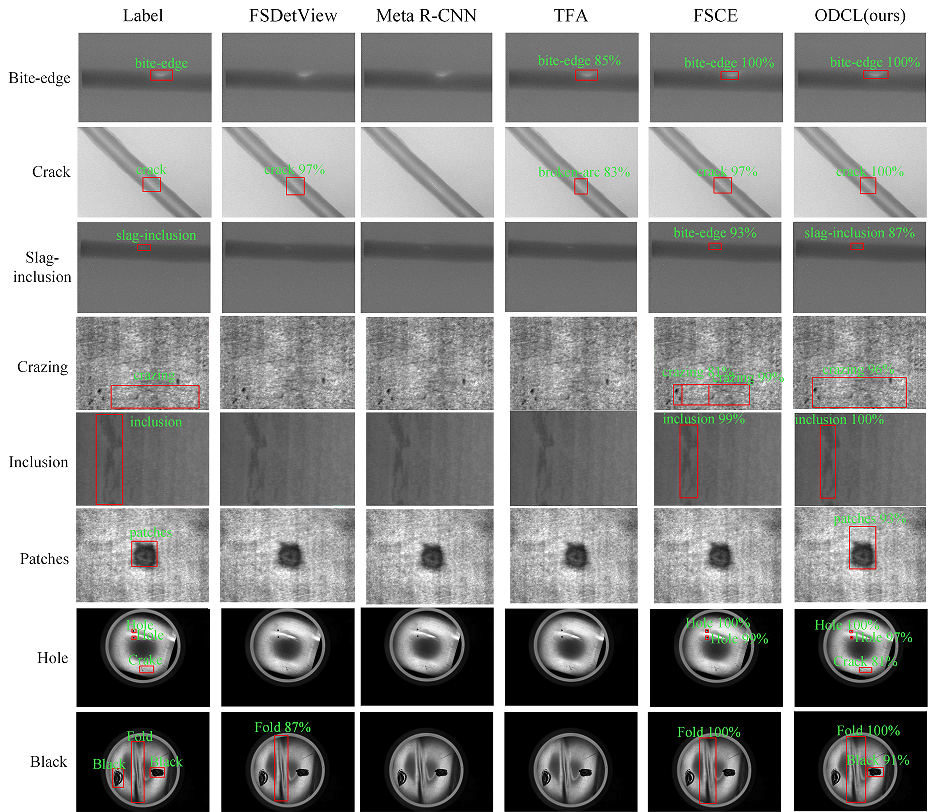

#  Object  Disentanglement and Contrastive Learning Model for Few-Shot Industrial Defect  Detection  （ODCL）

This repo contains the implementation of our fewshot object detector,Object  Disentanglement and Contrastive Learning Model for Few-Shot Industrial Defect  Detection（ODCL）.




## 1 Visualization of experimental results

Results of the experimental effectiveness of the ODCL method in comparison with other existing methods：






## 2 Installation

Which is built on [Detectron2](https://github.com/facebookresearch/detectron2). But you don't need to build detectron2 seperately as this codebase is self-contained. You can follow the instructions below to install the dependencies and build `FsDet`.

**Dependencies**

* Linux with Python >= 3.6
* [PyTorch](https://pytorch.org/get-started/locally/) >= 1.3 
* [torchvision](https://github.com/pytorch/vision/) that matches the PyTorch installation
* Dependencies: ```pip install -r requirements.txt```
* pycocotools: ```pip install pycocotools==2.0.0'```
* [fvcore](https://github.com/facebookresearch/fvcore/): ```pip install 'git+https://github.com/facebookresearch/fvcore'``` 
* [OpenCV](https://pypi.org/project/opencv-python/), optional, needed by demo and visualization ```pip install opencv-python```
* GCC >= 4.9

**Build**

```bash
pip install -r requirements.txt
python setup.py build develop  # you might need sudo
```

Note: you may need to rebuild ODCL after reinstalling a different build of PyTorch.

## 3 Data preparation

In the experiments of this paper, three datasets of Pipe Weld Defect, Hot Rolled Strip Defect, and Aluminum Alloy Defect Dataset are selected for experiments. The splits can be found in **fsdet/data/datasets/builtin_meta.py**.

Pipe Weld Defect：We randomly split the 8 object classes into 5 base classes and 3 novel classes.

Hot Rolled Strip Defect：We randomly split the 8 object classes into 4 base classes and 4 novel classes.

Aluminum Alloy Defect Dataset：We randomly split the 4 object classes into 2 base classes and 2 novel classes.

The datasets and data splits are built-in, simply make sure the directory structure agrees with **datasets/README.md** to launch the program. 

## 4 Code Structure

The code structure follows Detectron2 v0.1.* and fsdet. 

- **configs**: Configuration  files (`YAML`) for train/test jobs. 
- **datasets**: Dataset files (see **Data Preparation** for more details)
- **fsdet**
  - **checkpoint**: Checkpoint code.
  - **config**: Configuration code and default configurations.
  - **data**: Dataset code.
  - **engine**: Contains training and evaluation loops and hooks.
  - **evaluation**: Evaluation code for different datasets.
  - **layers**: Implementations of different layers used in models.
  - **modeling**: Code for models, including backbones, proposal networks, and prediction heads.
  - **solver**: Scheduler and optimizer code.
  - **structures**: Data types, such as bounding boxes and image lists.
  - **utils**: Utility functions.
- **tools**
  - **train_net.py**: Training script.
  - **test_net.py**: Testing script.
  - **ckpt_surgery.py**: Surgery on checkpoints.

## 5 Train & Inference

### Training

We follow the eaact training procedure of FsDet and we use **random initialization** for novel weights. For a full description of training procedure, see [here](https://github.com/ucbdrive/few-shot-object-detection/blob/master/docs/TRAIN_INST.md).

#### 1. Stage 1: Training base detector.

```
python tools/train_net.py --num-gpus 1 \
        --config-file configs/PASCAL_VOC/base-training/R101_FPN_base_training_split1.yml
```

#### 2. Random initialize  weights for novel classes.

```
python tools/ckpt_surgery.py \
        --src1 checkpoints/voc/faster_rcnn/faster_rcnn_R_101_FPN_base1/model_final.pth \
        --method randinit \
        --save-dir checkpoints/voc/faster_rcnn/faster_rcnn_R_101_FPN_all1
```

This step will create a `model_surgery.pth` from` model_final.pth`. 

#### 3. Stage 2: Fine-tune for novel data.

```
python tools/train_net.py --num-gpus 8 \
        --config-file configs/PASCAL_VOC/split1/CIR_10_CONTRASTIVE_20_1shot.yml \
        --opts MODEL.WEIGHTS WEIGHTS_PATH
```

Where `WEIGHTS_PATH` points to the `model_surgery.pth` generated from the previous step.

#### Evaluation

To evaluate the trained models, run

```angular2html
python tools/test_net.py --num-gpus 1 \
        --config-file checkpoints/CIR_30_CONTRASTIVE_10_1shot/config.yaml \
        --eval-only MODEL.WEIGHTS checkpoints/CIR_30_CONTRASTIVE_10_1shot/model_final.pth
```

Or you can specify `TEST.EVAL_PERIOD` in the configuation yml to evaluate during training. 
